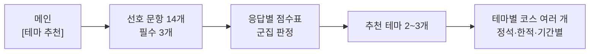
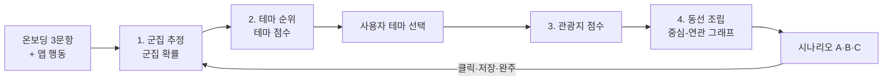
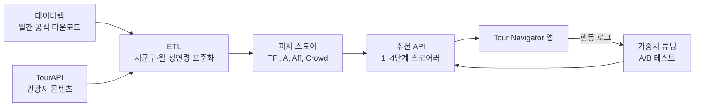

# Tour Navigator 고도화 전략 :  타깃 군집별 테마 시나리오 알고리즘

Sep 24, 2026 · @SEO MOKWON

## 요약

Tour Navigator의 다음 단계는 "테마를 고르게 하는 앱"에서 "데이터가 사용자 군집에 맞는 테마와 동선을 먼저 제안하는 앱"으로의 전환입니다. 한국관광 데이터랩의 성·연령별 방문/소비, 관광지별 방문 집중률, 내비게이션 검색, 중심-연관 관광지 데이터를 결합해 세 개의 엔진을 만듭니다.

1. **군집 추정 엔진** — \[테마 추천\]의 선호 문항 14개와 앱 행동으로 사용자를 10개 타깃 군집에 확률적으로 배정
2. **테마 추천 엔진** — 군집×테마 친화도(lift)에 계절성·트렌드를 곱해 12개 테마의 순위를 산출
3. **시나리오 조립 엔진** — 선택 테마 안에서 관광지를 점수화하고, 중심-연관 관광지 네트워크로 동선을 이어 3가지 시나리오(정석·트렌드·한적)로 제시

모든 추천에는 "20대 검색 급증", "가족 방문 집중률 상위"처럼 데이터랩 지표 근거 배지를 붙여 설명 가능성을 확보합니다. 참고로 데이터랩의 2026 활용 경진대회 접수가 9월 30일에 마감되므로, 이 전략을 출품안으로 다듬는 것도 선택지입니다.

## 테마 추천 플로우와 선호 문항

메인 화면 하단의 \[테마 추천\]에서 선호 문항에 답하면, 응답별 점수표로 군집을 정하고 그 군집에 맞는 테마와 테마별 코스를 여러 개 보여줍니다.



Q1\~Q9는 군집을 정~~하고~~, Q10\~Q14는 코스를 거르는 필터입니다. 한 화면에 한 문항, 필수는 Q1\~Q3이고 나머지는 건너뛸 수 있습니다(0점 처리).

| 문항 | 보기 | 용도 |
| --- | --- | --- |
| Q1 연령대 | 10대 · 20대 · 30대 · 40대 · 50대 · 60대 · 70대 이상 | 군집 판정 |
| Q2 동반자 | 혼자 · 친구 · 연인 · 배우자 · 아이와 가족 · 부모님 모시고 · 친목 모임 | 군집 판정 |
| Q3 여행 속도 | 빡빡하게 · 적당히 · 천천히 | 군집 판정 |
| Q4 관심사 (최대 2) | 드라마·K팝 촬영지 · 공연·콘서트 · 역사·유적 · 자연·숲길 · 바다 · 맛집·시장 · 체험 · 야경 · 쇼핑·뷰티·스파 | 군집 판정 + 테마 가산점 |
| Q5 분위기 | 요즘 뜨는 핫플 · 대표 명소 · 한적한 곳 | 군집 판정 |
| Q6 거주 | 국내 · 해외 방문 | 외래객(C7·C8) 구분 |
| Q7 1인 경비 | 7만 원 미만 · 7만\~15만 · 15만\~25만 · 25만 원 이상 (해외 방문객: 1일 $100 이하 · $100\~300 · $300\~500 · $500 초과) | 군집 판정 + 가격대 |
| Q8 활동 시간대 | 아침 일찍 · 낮 위주 · 저녁·밤까지 | 군집 판정 + 일정 시간대 |
| Q9 정보 얻는 곳 | 가 본 경험 · 지인 추천 · 인터넷·앱 · SNS·유튜브 · 정보 없이 | 군집 판정 |
| Q10 출발 시기 | 이번 주말 · 이번 달 · 다음 달 이후 | 필터 (계절·축제) |
| Q11 기간 | 당일(기본값) · 1박 2일 · 2박 3일 이상 | 필터 |
| Q12 이동수단 | 자가용(기본값) · 대중교통 · 비행기 · 단체버스 | 필터 |
| Q13 하루 걷기 | 1시간 이내 · 1\~3시간 · 3시간 이상 | 필터 (동선 길이) |
| Q14 조건 | 반려동물 · 무장애 · 비 오는 날 실내 위주 | 필터 |

## 응답별 점수표와 군집 판정

고른 보기의 점수를 군집별로 더해 가장 높은 군집이 대표 군집이 됩니다. 점수는 "그 군집이 이 보기를 평균보다 몇 배 더 고르는가(lift)"로 정합니다.

```latex
\text{점수} = \mathrm{round}\big(2 \cdot \log_2(\text{lift})\big),\ 0\sim3\ \text{으로 자름}
```

| 문항 | 보기 | C1 | C2 | C3 | C4 | C5 | C6 | C7 | C8 | C9 | C10 | 근거 |
| --- | --- | --- | --- | --- | --- | --- | --- | --- | --- | --- | --- | --- |
| Q1 | 10대 | 1 | 0 | 0 | 0 | 0 | 0 | 2 | 0 | 0 | 0 | 데이터 |
| Q1 | 20대 | 2 | 3 | 0 | 0 | 0 | 0 | 1 | 0 | 0 | 0 | 데이터 |
| Q1 | 30대 | 0 | 2 | 0 | 0 | 1 | 0 | 0 | 0 | 0 | 0 | 데이터 |
| Q1 | 40대 | 0 | 0 | 2 | 0 | 0 | 0 | 0 | 0 | 0 | 0 | 데이터 |
| Q1 | 50대 | 0 | 0 | 0 | 1 | 0 | 0 | 0 | 0 | 0 | 1 | 데이터 |
| Q1 | 60대 | 0 | 0 | 0 | 2 | 0 | 0 | 0 | 0 | 0 | 1 | 데이터 |
| Q1 | 70대 이상 | 0 | 0 | 0 | 3 | 0 | 0 | 0 | 0 | 0 | 1 | 데이터 |
| Q2 | 혼자 | 1 | 0 | 0 | 0 | 3 | 0 | 1 | 1 | 0 | 0 | 정의 · 외래 데이터 |
| Q2 | 친구와 | 3 | 0 | 0 | 0 | 0 | 1 | 0 | 0 | 0 | 0 | 정의 · 외래 데이터 |
| Q2 | 연인과 | 0 | 3 | 0 | 0 | 0 | 0 | 0 | 0 | 0 | 1 | 정의 · 외래 데이터 |
| Q2 | 배우자와 | 0 | 1 | 0 | 2 | 0 | 0 | 0 | 0 | 0 | 1 | 정의 · 외래 데이터 |
| Q2 | 아이와 가족 | 0 | 0 | 3 | 0 | 0 | 0 | 0 | 0 | 1 | 0 | 정의 · 외래 데이터 |
| Q2 | 부모님 모시고 | 0 | 0 | 1 | 2 | 0 | 1 | 0 | 0 | 0 | 1 | 가설 · 외래 데이터 |
| Q2 | 친목 모임 | 0 | 0 | 0 | 3 | 0 | 1 | 0 | 0 | 0 | 0 | 정의 |
| Q3 | 빡빡하게 | 2 | 0 | 0 | 0 | 0 | 0 | 2 | 0 | 0 | 0 | 가설 |
| Q3 | 적당히 | 0 | 1 | 1 | 0 | 0 | 1 | 0 | 1 | 0 | 0 | 가설 |
| Q3 | 천천히 | 0 | 0 | 0 | 2 | 3 | 0 | 0 | 0 | 0 | 0 | 가설 |
| Q4 | 드라마·K팝 촬영지 | 2 | 1 | 0 | 0 | 0 | 0 | 3 | 0 | 0 | 0 | 정의 · 외래 데이터 |
| Q4 | 공연·콘서트 (신규) | 1 | 1 | 0 | 0 | 0 | 0 | 3 | 0 | 0 | 0 | 외래 데이터 |
| Q4 | 역사·유적 | 0 | 0 | 1 | 3 | 0 | 0 | 0 | 0 | 0 | 3 | 정의 · 외래 데이터 |
| Q4 | 자연·숲길 | 0 | 0 | 0 | 2 | 3 | 0 | 0 | 0 | 2 | 1 | 정의 · 외래 데이터 |
| Q4 | 바다 | 0 | 2 | 2 | 0 | 0 | 0 | 0 | 0 | 2 | 0 | 가설 (C9: 제주 방문 3.2배) |
| Q4 | 맛집·시장 | 1 | 0 | 0 | 0 | 0 | 3 | 0 | 0 | 0 | 0 | 정의 |
| Q4 | 체험·액티비티 | 1 | 0 | 3 | 0 | 0 | 0 | 0 | 0 | 0 | 2 | 정의 · 외래 데이터 |
| Q4 | 야경 | 2 | 2 | 0 | 0 | 0 | 0 | 0 | 0 | 0 | 0 | 가설 |
| Q4 | 쇼핑·뷰티·스파 | 0 | 0 | 0 | 0 | 0 | 0 | 0 | 3 | 0 | 0 | 외래 데이터 |
| Q5 | 요즘 뜨는 핫플 | 3 | 0 | 0 | 0 | 0 | 0 | 1 | 0 | 0 | 0 | 가설 |
| Q5 | 대표 명소 | 0 | 0 | 1 | 1 | 0 | 0 | 1 | 1 | 0 | 0 | 가설 |
| Q5 | 한적한 곳 | 0 | 0 | 0 | 1 | 3 | 1 | 0 | 0 | 0 | 0 | 가설 |
| Q7 | 7만 원 미만 | 2 | 0 | 0 | 0 | 1 | 0 | 0 | 0 | 0 | 0 | 가설 |
| Q7 | 7만\~15만 원 | 0 | 1 | 1 | 1 | 0 | 1 | 0 | 0 | 0 | 0 | 가설 |
| Q7 | 15만\~25만 원 | 0 | 1 | 0 | 0 | 0 | 2 | 0 | 0 | 0 | 0 | 가설 |
| Q7 | 25만 원 이상 | 0 | 0 | 0 | 0 | 0 | 0 | 0 | 0 | 0 | 0 | 가설 |
| Q7 해외 | 1일 $100 이하 | 0 | 0 | 0 | 0 | 0 | 0 | 0 | 0 | 0 | 1 | 외래 데이터 |
| Q7 해외 | 1일 $500 초과 | 0 | 0 | 0 | 0 | 0 | 0 | 0 | 2 | 0 | 0 | 외래 데이터 |
| Q8 | 아침 일찍부터 | 0 | 0 | 0 | 2 | 1 | 0 | 0 | 0 | 0 | 0 | 가설 |
| Q8 | 낮 시간 위주 | 0 | 0 | 2 | 1 | 0 | 0 | 0 | 1 | 0 | 0 | 가설 |
| Q8 | 저녁·밤까지 | 2 | 2 | 0 | 0 | 0 | 0 | 1 | 0 | 0 | 0 | 가설 |
| Q9 | 가 본 경험 | 0 | 0 | 0 | 0 | 0 | 0 | 0 | 1 | 0 | 0 | 데이터 |
| Q9 | 인터넷·앱 | 1 | 1 | 0 | 0 | 0 | 0 | 0 | 0 | 0 | 0 | 데이터 |
| Q9 | SNS·유튜브 | 1 | 1 | 0 | 0 | 0 | 0 | 1 | 0 | 1 | 0 | 데이터 |
| Q9 | 지인 추천 · 정보 없이 | 0 | 0 | 0 | 0 | 0 | 0 | 0 | 0 | 0 | 0 | 데이터 |

해외 Q7의 나머지 구간($100\~300, $300\~500)은 모든 군집 0점입니다.

근거 — **데이터**: C1\~C6은 2025 국민여행조사 연령별 표, C7·C8은 2025 외래관광객조사 원자료(여가 목적 10,471명, 가중치 적용)로 lift를 계산. **정의**: 군집을 정의하는 보기. **가설**: 두 조사에 교차가 없는 칸(Q3·Q5·Q8 등)으로, 국민여행조사 원자료 확보 후 교체. 해외 방문객에게 Q7은 1일 경비(USD) 구간으로 표시합니다.

### 판정 규칙

- Q6에서 국내 거주면 C7·C8 제외, 해외 방문이면 C7·C8에 각 +2점(C1\~C6도 후보 유지). 앱 언어가 한국어가 아니면 Q6을 해외로 미리 선택하고, 중국어면 C7 +1·C9 +1(중국 방한객 K-컴처 1.31배, 자연·지방 1.62배), 일본어면 C8 +1(뷰티·의료 1.40배), 영어·스페인어면 C10 +2(구미 방한객 역사·전통문화형 1.9\~2.2배). C9·C10도 해외 방문 시 +2.
- 군집 확률 = 2^(합계÷2)의 비율. 1위 확률이 50% 미만이면 두 군집을 섞어 추천.
- 예시(60대 / 배우자 / 천천히 / 역사·자연 / 한적 / 국내 / 7만\~15만 원 / 아침형 / 가 본 경험): C4 액티브 시니어 15점(82%), C5 나홀로 힐링 10점(15%) → 대표 군집 C4.

## 2025 국민여행조사 근거

문항 점수와 기본값은 2025 국민여행조사 보고서(통계편·분석편, 만 15세 이상 연간 51,600명, 관광여행 경험자 기준)의 공표 표에서 가져왔습니다.

| 항목 (표) | 핵심 수치 | 앱 반영 |
| --- | --- | --- |
| 여행 일정 (7-2) | 당일 58.3% · 1박2일 30.4% · 2박3일 9.1% · 3박+ 2.3% | Q11 기본값 당일, 당일 코스를 맨 앞에 |
| 동반자 유형 (14-2-1) | 배우자 51.7% · 자녀 32.1% · 친구 28.1% · 연인 8.1% · 친목 모임 4.4% | Q2 연인/배우자 분리, 친목 모임 추가 |
| 연령별 동반자 (14-2-1) | 20대 친구 55.3%·연인 28.6%, 40대 자녀 63.1%, 70대+ 친목 모임 13.3% | Q1 점수 (lift) |
| 동반자 수 (14-1-1) | 혼자 3.1%, 1인 가구 10.2% | C5 나홀로는 소수 군집 |
| 여행지 활동 (15-1) | 자연 77.4% · 음식 65.6% · 역사 10.7% · 테마파크 9.3%. 연령 차이는 테마파크(20\~30대 1.3\~1.4배, 60대+ 0.5배)·촬영지(20대 1.5배)·온천(60대+ 1.4배)에서만 뚜렷 | 군집 가중치는 원자료 교차 필요 |
| 1회 관광여행 지출 (4-6) | 1인 14.0만 원 (숙박 23.5만, 당일 7.1만) | Q7 구간 7만 / 15만 / 25만 원 |
| 정보 획득 (10-2-1, 11-2-1) | 인터넷·앱 20대 39.1% vs 70대+ 9.4%, SNS 20대 34.4% vs 60대 12.6% | Q9 점수 |
| 이동 수단 (16-1-1) | 자가용 84.5%, 20대 75.9% | Q12 기본값 자가용 |
| 반려동물 (14-5-1) | 함께 여행 3.0%, 키우지만 두고 감 21.2% | Q14 필터 유지 |
| 방문지 (8-4) | 20대 서울 1.8배·부산 1.5배, 60대 경북 1.2배·제주 1.1배 | 테마 지역 보정 |

공표 표는 연령·가구원수 등 한 축으로만 나뉘어, "동반 형태 × 활동" 교차는 [통계청 MDIS 원자료](https://know.tour.go.kr/stat/fRawDataDownloadDis19Re.do)가 있어야 계산할 수 있습니다. 외래객 군집(C7·C8)은 아래 섹션처럼 원자료로 반영했습니다(참고: [2025 외래관광객조사 최종 보고서](https://know.tour.go.kr/stat/fReportsOfForeignerDis19Re.do)(2026.05.26 게시)).

## 2025 외래관광객조사 원자료 근거 (C7·C8)

원자료(16,110명) 중 방한 목적이 여가인 10,471명에 연간 가중치를 적용했습니다. C7은 K팝·한류 공연장·촬영지 방문자, C8은 뷰티·미용 또는 치료·건강검진 참여자로 정의해 개인 단위 lift를 직접 계산했습니다.

| 항목 | C7 K-컴처 | C8 웰니스 | 앱 반영 |
| --- | --- | --- | --- |
| 비중 | 17.3% | 19.9% (겹침 2.7%) | 해외 방문 시 +2 |
| 연령 | 10대 2.2배, 20대 1.5배 | 차이 작음 | Q1 C7 점수 |
| 동반자 | 혼자 1.7배, 연인·배우자 0.4배 | 혼자 1.2배 | Q2 혼자 1점 |
| 활동 | 공연 관람 2.8배, 자연 0.6배 | 뷰티·의료 5.0배 | Q4 공연·콘서트 보기 신설 |
| 1일 지출 | $287 (평균 $322) | $419, $500 초과 2.0배 | Q7 해외 구간 |
| 정보 경로 | SNS·동영상 1.27배 | 재방문 1.22배 | Q9 점수 |
| 방문 지역 | 서울 1.16배, 부산 0.77, 제주 0.25 | 서울 1.15배, 부산 0.71, 제주 0.40 | 외래객 지역 보정 |
| 국적 | 중국 22.6%, 홍콩 19.9% | 중동 41.1%, 일본 27.8% | 앱 언어 가산 |

### 원자료 군집 분석 결과 (가중 k-평균, k=6)

| 데이터 군집 | 비중 | 특징 | 대응 |
| --- | --- | --- | --- |
| 뷰티·의료 도시형 | 23.7% | 건강검진 2.5배, 1일 $500+ 1.8배, 서울 93% | C8 ✓ |
| 자연·지방 여행형 | 22.8% | 자연경관 1.8배, 지방 1.6배, 제주 38% | 신규 후보 C9 |
| 전통문화 체험형 | 15.4% | 전통문화 5.6배, 축제 3.0배 | 신규 후보 C10 |
| 고궁·역사 시니어형 | 13.8% | 고궁·역사 2.6배, 60대+ 1.6배 | 신규 후보 C10 |
| K팝·공연 청년형 | 12.8% | K팝 5.8배, 공연 3.2배, 10대 2.4배 | C7 ✓ |
| 박물관·역사 단체 탐방형 | 11.6% | 박물관 4.3배, 단체여행 2.4배, 부산 40% | 신규 후보 C10 |

가설 C7·C8은 데이터에서도 뚜렷한 군집으로 나왔고, 나머지 절반을 C9 자연·지방형과 C10 역사·전통문화형(세 군집 합)으로 추가했습니다. 추가 전에는 외래객 추천이 서울 테마로 쏠렸습니다.

| 항목 | C9 자연·지방형 | C10 역사·전통문화형 |
| --- | --- | --- |
| 비중 | 22.8% | 40.8% |
| 연령·동반자 | 자녀 동반 1.4배 | 60대+ 1.4배, 배우자 1.5배, 단체여행 1.9배 |
| 활동 | 자연경관 1.8배, 역사 0배 | 고궁·역사 2.4배, 박물관 2.3배, 전통문화 2.1배 |
| 방문 지역 | 제주 3.15배, 서울 0.68배 | 경북 2.4배, 경남 2.1배, 강원 2.0배, 부산 1.9배 |
| 국적 | 중국 37%, 태국 25% | 프랑스 88%, 영국 86%, 미국 80% |
| 카테고리 가중치 (역사·힐링·액티비티·먹거리·해양) | .02 · .33 · .07 · .21 · .36 | .31 · .19 · .19 · .13 · .18 |

## 데이터 소스 매핑

데이터랩 16개 메뉴를 알고리즘의 4개 입력층(군집 프로파일·테마 강도·관광지 점수·동선)으로 변환합니다. 데이터랩은 공식 다운로드(Excel/CSV) 외 무단 수집을 금지하므로, 월 1회 공식 다운로드 + 관광공사 OpenAPI(TourAPI) 조합으로 파이프라인을 설계합니다.

| 데이터랩 메뉴 | 쓰는 지표 | 알고리즘 입력 | 앱 기능 |
| --- | --- | --- | --- |
| 성/연령별 방문·소비 현황 | 성·연령대별 방문자수, 업종별 소비액 | 군집 프로파일, 군집×테마 친화도 A\[c,t\] | 군집별 테마 순위 |
| 관광지별 성/연령 방문 집중률 | 관광지별 성·연령 집중률 | 관광지×군집 친화도 Aff(p,c) | "우리 또래가 많이 가는 곳" |
| 인기관광지 현황 | 세대별 계절 Top5, 핫플, 급등 동네 | 트렌드 점수 Trend(p) | 트렌드 시나리오(B안) |
| 내비게이션 지역별 관광지 검색순위 | 관광지 검색건수·순위 변화 | 관심도·선행지표 | 검색 급증 배지 |
| 이동통신 지역별 방문자수 | 시군구·일자별 외지인 방문자수 | 혼잡도 Crowd(p), 계절 지수 | 한적 시나리오(C안), 혼잡 경고 |
| 신용카드 지역별 관광지출액 | 업종별(식음·숙박·쇼핑·레저) 지출 | 미식/쇼핑 테마 강도, 예산 추정 | 예산대별 필터 |
| 중심-연관 관광지 지도 | 중심 관광지와 연관 관광지 연결 | 동선 그래프 G의 간선 가중치 | 다음 방문지 추천, 동선 조립 |
| 특화관광 테마 현황(야간·한류·캠핑·걷기·해양) | 테마별 방문·소비·관심도 | 테마 강도 TFI(r,t) | 테마 카드, 지역별 테마 지도 |
| 문화관광축제 현황 | 축제 기간, 방문객, 소비 | 이벤트 가산점, 시즌 윈도 | 이번 주 축제 시나리오 |
| 관광수요 지수 | 지역별 관광 수요 지수 | 지역 활성도 | 지역 선택 보조 |
| 인구감소지역 현황·프로파일링 | 인구감소지역, 관광대체 효과 | 지역상생 가산점 Local(p) | "숨은 명소" 슬롯 |
| 국가별 방한현황(빅데이터)·외래객 지역별 방한현황 | 국적별 방문 지역·소비 | 외래객 군집 프로파일 | 외국어·국적별 시나리오 |
| 한류관광 현황·방한여행 트렌드 | 한류 소비 업종, 소셜 언급량 | K-컬처 테마 강도, 트렌드 | K-컬처 테마 |
| 의료관광 현황 | 진료과목·국적별 소비 | 웰니스 테마 강도 | 웰니스 테마(외래객) |
| 국민여행조사·외래관광객조사 | 동반자 유형, 여행 목적, 활동 | 온보딩 문항의 사전확률 P(c) | 온보딩 설계 |
| 관광불편신고·관광안내(VOC) | 지역·유형별 불편 건수 | 리스크 감점 Risk(p) | 주의 안내 |

관광지 명칭·좌표·운영시간·사진 등 콘텐츠는 TourAPI에서 받아 데이터랩의 지역·관광지 지표와 관광지명·시군구 코드로 조인합니다.

## 타깃 군집 정의

내국인 6개, 외래객 4개 등 10개 군집으로 시작합니다. 데이터랩 데이터는 개인 단위가 아닌 집계(성·연령·지역·업종)이므로, 군집은 집계 데이터로 "프로파일"을 만들고 사용자는 온보딩 응답으로 그 프로파일에 확률 배정하는 구조입니다.

| 군집 | 핵심 속성 | 데이터랩 근거 지표 | 선호 성향 |
| --- | --- | --- | --- |
| C1 MZ 트렌드 탐색형 | 20대, 친구 동반, 당일·1박 | 20대 핫플·급등 동네, 검색순위 상승 | 신상 핫플, 카페, 야간 |
| C2 커플 감성형 | 20\~30대, 연인 | 20\~30대 관광지 집중률, 야간관광 | 뷰 포인트, 야간, 미식 |
| C3 키즈 가족형 | 30\~40대, 영유아·초등 동반 | 30\~40대 집중률, 캠핑·해양 소비 | 체험, 캠핑, 해양 |
| C4 액티브 시니어형 | 50\~60대, 부부·동호회 | 50대 이상 집중률, 걷기여행 | 걷기, 자연, 역사 |
| C5 나홀로 힐링형 | 전 연령, 1인 | 국민여행조사 1인 여행 비중 | 한적한 자연, 걷기 |
| C6 미식 로컬형 | 전 연령, 식음 지출 비중 높음 | 카드 식음업 지출 비중 | 노포, 시장, 로컬 |
| C7 외래객 K-컬처형 | 20\~30대 외국인 | 한류관광 소비·언급량, 국적별 방문지 | K-팝·드라마 성지, 쇼핑 |
| C8 외래객 웰니스·프리미엄형 | 30\~50대 외국인 | 의료관광 소비, 고가 쇼핑 | 웰니스, 쇼핑, 미식 |
| C9 외래객 자연·지방형 (신규) | 여가 방한객 22.8%, 자녀 동반, 중국·태국 | 외래관광객조사 원자료 k-평균 군집 | 자연경관, 제주(3.2배) |
| C10 외래객 역사·전통문화형 (신규) | 여가 방한객 40.8%, 50대+·배우자·단체, 구미·동남아 | 외래관광객조사 원자료 k-평균 3개 군집 합 | 고궁·박물관·전통문화, 지방 도시(경북·강원·부산) |

### 군집화 방법

1. **오프라인(월 1회)**: 성·연령대 × 동반유형 × 업종 소비 × 테마 방문을 행렬로 만들고, 행 정규화 후 k-means(k=6\~10, 실루엣 점수로 결정)로 군집 경계를 검증합니다. 국민여행조사 원자료가 확보되면 범주형 변수까지 쓰는 k-prototypes로 교체합니다.
2. **온라인 배정**: 선호 문항 Q1\~Q9의 응답별 점수표로 군집 확률을 계산하고(점수표는 위 섹션), 이후 테마 클릭·저장·동선 완주를 관측할 때마다 베이즈 갱신합니다.
3. **소프트 멤버십**: 한 사용자를 한 군집에 고정하지 않고 확률 벡터로 유지합니다. 예: 30대 부부가 아이 없이 떠나면 C2 0.55, C6 0.30, C3 0.15.

## 테마 체계

테마는 데이터랩의 5개 특화관광 테마를 뼈대로 12개로 확장합니다. 각 테마는 지역(시군구) r 단위의 테마 강도 지수 TFI(r,t)를 가지며, 이것이 "이 지역이 이 테마를 얼마나 잘 하는가"를 나타냅니다.

| 테마 | 주 데이터 소스 | TFI 구성 지표 |
| --- | --- | --- |
| 야간관광 | 야간관광 현황 | 야간 방문자·소비 비중 |
| K-컬처(한류) | 한류관광 현황, 방한여행 트렌드 | 한류 목적·영향 소비, 소셜 언급량 |
| 캠핑 | 캠핑관광 현황 | 캠핑장 수, 캠핑 방문 |
| 걷기여행 | 걷기여행 현황 | 걷기길 수, 걷기 방문 |
| 해양 | 해양관광 현황 | 해양 방문·소비 |
| 축제·이벤트 | 문화관광축제 현황 | 기간 중 방문 증가율 |
| 미식 | 신용카드 관광지출액 | 식음업 지출 비중 |
| 쇼핑 | 신용카드 관광지출액 | 쇼핑업 지출 비중 |
| 역사·문화유산 | 관광지별 분석 + TourAPI 분류 | 문화시설 관광지 방문 |
| 자연·힐링 | 관광지별 분석 + TourAPI 분류 | 자연 관광지 방문, 낮은 혼잡도 |
| 체험·키즈 | 관광지별 성/연령 집중률 | 30\~40대 집중률 + 체험 분류 |
| 웰니스·의료 | 의료관광 현황 | 의료·웰니스 소비 |

### 테마 강도 지수

각 지표를 전국 평균 대비 비율(입지계수, LQ)로 바꾼 뒤 가중평균하고 0\~1로 정규화합니다.

```latex
\mathrm{TFI}(r,t) = \mathrm{minmax}\Big( \sum_k \alpha_k \cdot \log \frac{x_k(r,t) / X_k(r)}{x_k(\cdot,t) / X_k(\cdot)} \Big)
```

x\_k(r,t)는 지역 r의 테마 t 지표, X\_k(r)는 지역 전체값입니다. 로그 LQ를 쓰면 관광 규모가 큰 서울·부산이 모든 테마를 독식하는 현상을 막아, 작은 지역의 특화 테마가 드러납니다.

## 기존 앱 테마와의 연결

[현재 앱](https://github.com/TourLabOrganization/Tour-Navigator-App)의 테마는 두 층입니다. 사용자가 고르는 것은 영상 IP 코스 5개이고, 코스 안의 장소는 5개 카테고리로 분류됩니다. 따라서 12개 표준 테마는 새 메뉴가 아니라 두 층을 데이터랩에 잇는 내부 스코어링 축으로 씁니다.

### 1층: IP 코스 테마 ↔ 군집·데이터랩

5개 코스는 모두 데이터랩의 '한류관광' 테마에 속합니다. 그래서 코스를 가르는 변수는 테마가 아니라 지역(시군구)과 군집입니다.

| 앱 테마 (지역) | 주력 군집 | 보조 군집 | 연결할 데이터랩 지표 |
| --- | --- | --- | --- |
| 케이팝 데몬 헌터스 (서울) | C7 K-컬처 | C1 MZ 트렌드 | 한류관광 소비·언급량, 외래객 지역별 방한현황, 서울 급등 동네 |
| RESCENE Route (경주·거제·전국) | C1 MZ 트렌드 | C3 키즈 가족, C7 | 경주·거제 20대 방문 집중률, 해양관광, 내비 검색 증가율 |
| 제주 K-Drama (제주) | C2 커플 감성 | C3 키즈 가족, C7 | 제주 성·연령 집중률, 해양·걷기 현황, 국적별 방한 |
| 부산 영화 기행 (부산) | C2 커플 감성 | C6 미식, C1 | 부산 카드 식음 지출, 야간관광, 부산국제영화제 기간 방문 증가 |
| 왕과 사는 남자 (영월) | C4 액티브 시니어 | C5 나홀로 힐링 | 영월 50대 이상 집중률, 인구감소지역 관광대체 효과, 걷기여행 |

홈의 '나의 테마' 타일 순서와 배너 5장의 회전 순서를 사용자 군집 확률 기준 코스 점수 S(코스|u)로 정렬하면 됩니다. 코스 점수는 2단계 공식에서 테마 t 대신 코스의 지역 r과 한류 강도를 넣어 계산합니다. 마지막 '테마 추가(+)' 칸은 아직 없는 코스 후보(예: 전주 사극, 강릉 드라마)를 같은 점수로 추천하는 자리로 씁니다.

### 2층: 장소 카테고리 ↔ 표준 테마

| 앱 카테고리 (코드) | 장소 수 | 표준 테마 | 데이터랩 소스 |
| --- | --- | --- | --- |
| 힐링·생태 (heal) | 343 | 자연·힐링, 걷기여행 | 걷기여행 현황, 이동통신 혼잡도 |
| 역사·문화 (herit) | 298 | 역사·문화유산 | 관광지별 분석, 성/연령 집중률 |
| 테마파크·액티비티 (activity) | 198 | 체험·키즈, 캠핑 | 관광지별 30\~40대 집중률, 캠핑관광 현황 |
| 로컬·먹거리 (food) | 102 | 미식 | 신용카드 식음업 지출 |
| 해양·자연 (sea) | 99 | 해양 | 해양관광 현황 |

장소 수는 `assets/tour-places.csv` 기준이며, 분류가 비어 있는 153곳은 TourAPI 분류로 채워야 합니다. 야간관광·쇼핑·축제는 앱에 대응 카테고리가 없으므로 카테고리를 늘리지 않고 장소 속성(야간 운영, 축제 기간)으로 붙입니다.

### 기존 배지·기능의 재활용

- **열린관광지(무장애) 99곳**: C4 시니어·C3 가족에게 Risk 감점 대신 가산점
- **유네스코·한국관광 100선**: A안(정석) 시나리오의 필수 후보
- **코스 자동 생성(하루 9\~12시간 예산)**: 4단계 동선 조립이 들어갈 자리. 기존 로직에 군집 가중치 w와 중심-연관 그래프만 추가
- **다국어 5개 언어**: 언어 설정을 C7·C8 외래객 군집의 사전확률 신호로 사용

## 장소 분류 개편과 테마 적합 점수

앱은 장소마다 카테고리를 하나만 붙여, 해운대·광안리·협재 같은 바닷가가 힐링으로 들어가 부산·제주 테마의 해양 비중이 0%로 계산됐습니다. 분류를 두 겹으로 바꿉니다.

- **주 카테고리 1개 + 보조 1개**: 구성비는 주 0.6 + 보조 0.4 (보조 없으면 주 1.0). 예: 해운대해수욕장 = 해양(주) + 힐링(보조).
- **성격 태그**: 바다 · 야경 · 실내 · 촬영명소, 걷기 난이도 상/중/하. Q4 야경 가산점, Q13·Q14 필터에 씀.
- 앱 장소 1,269곳(마스터 1,197 + 테마 화면에만 있는 72)을 규칙으로 재분류한 초안: 주 카테고리 변경 40곳, 검토 필요 88곳.

| 앱 테마 | 역사 | 힐링 | 액티비티 | 먹거리 | 해양 (기존 → 새) | 야경 태그 |
| --- | --- | --- | --- | --- | --- | --- |
| 왕과 사는 남자 (영월) | 40% | 31% | 23% | 6% | 0% → 0% | 6% |
| 케이팝 데몬 헌터스 (서울) | 29% | 23% | 22% | 25% | 0% → 1% | 13% |
| RESCENE Route (경주·거제) | 33% | 17% | 13% | 19% | 20% → 18% | 6% |
| 제주 K-Drama | 17% | 44% | 8% | 5% | 0% → 26% | 4% |
| 부산 영화 기행 | 14% | 25% | 15% | 26% | 0% → 20% | 14% |

### 군집 × 테마 적합 점수

적합 점수 = 테마 구성비 × 군집별 카테고리 가중치(가설값)의 합입니다.

| 군집 | 영월 | 서울 케데헌 | RESCENE | 제주 | 부산 |
| --- | --- | --- | --- | --- | --- |
| C1 MZ 트렌드 | 0.16 | 0.19 | 0.18 | 0.15 | **0.20** |
| C2 커플 감성 | 0.14 | 0.18 | 0.19 | 0.21 | **0.22** |
| C3 키즈 가족 | **0.19** | **0.19** | 0.17 | 0.16 | 0.18 |
| C4 액티브 시니어 | **0.31** | 0.26 | 0.25 | 0.23 | 0.19 |
| C5 나홀로 힐링 | 0.23 | 0.19 | 0.19 | **0.34** | 0.23 |
| C6 미식 로컬 | 0.15 | **0.26** | 0.22 | 0.10 | 0.23 |
| C7 외래객 K-컴처 | 0.19 | **0.21** | 0.20 | 0.13 | 0.19 |
| C8 외래객 웰니스 | 0.14 | 0.20 | 0.20 | 0.21 | **0.24** |
| C9 외래객 자연·지방 | 0.14 | 0.15 | 0.18 | **0.26** | 0.22 |
| C10 외래객 역사·전통문화 | **0.23** | 0.21 | 0.22 | 0.20 | 0.19 |

### 최종 점수

```latex
\text{최종} = \text{적합 점수} + 0.5 \times (\text{고른 관심사 구성비 합} + \text{야경 태그 비중}) + \text{지역 보정}
```

지역 보정 = 0.1 × (사용자 연령대의 테마 지역 방문 lift − 1), ±0.05 한도입니다. 예시 사용자(60대 시니어, 역사·자연 관심)의 추천은 영월 0.67 → 제주 0.54 → RESCENE 0.51 순이고, 60대 방문이 적은 서울(케데헌)은 지역 보정 −0.04로 4위가 됩니다.

## 새 테마 적용 방법

새 테마를 추가해도 문항과 점수표는 고치지 않습니다. 장소마다 주·보조 카테고리와 태그만 달면 적합 점수가 자동으로 계산되고, **점수 상위 2개 군집**의 추천 목록에 등록됩니다.

1. 테마 등록: 이름, 지역(시군구), 장소별 주·보조 카테고리와 태그
2. 구성비·적합 점수 자동 계산 → 상위 2개 군집에 주 추천 등록
3. 지역 보정: 국민여행조사 연령별 방문지 lift 자동 적용
4. 검수: 주 추천 군집의 대표 사용자에게 상위 3위 안에 뜨는지 확인
5. 홈의 "테마 추가(+)" 타일과 배너 순서에 같은 점수 사용

처음 기준은 "적합 점수 0.30 이상"이었지만, 바다·힐링·역사가 고르게 섞인 통영 테마가 최고 0.26으로 어느 군집에도 등록되지 않아 상위 2개 기준으로 바꿨습니다.

| 가상 테마 | 구성비 | 주 추천 군집 (적합 점수) |
| --- | --- | --- |
| 통영·남해 섬 로맨스 (12곳) | 해양 38% · 힐링 25% · 역사 18% · 야경 17% | C5 나홀로 힐링 0.26 · C2 커플 0.23 |
| 키즈 애니 어드벤처 (10곳) | 액티비티 54% · 힐링 26% · 야경 20% | C3 키즈 가족 0.32 · C1 MZ 0.23 |
| 대구·안동 먹방 예능 로드 (10곳) | 먹거리 48% · 역사 20% · 야경 50% | C6 미식 로컬 0.39 · C8 웰니스 0.27 |
|  |  |  |

### 대표 사용자 4명 시험 (현재 5개 + 가상 3개)

| 대표 사용자 | 1위 | 2위 | 3위 |
| --- | --- | --- | --- |
| A 60대·배우자 (역사+자연) → C4 | 왕과 사는 남자 0.67 | 제주 K-Drama 0.54 | RESCENE 0.51 |
| B 40대·아이 가족 (체험+바다) → C3 | 키즈 애니 어드벤처 ★ 0.59 | 통영 섬 로맨스 ★ 0.38 | 부산 영화 기행 0.36 |
| C 50대·친구 미식 (맛집+역사) → C6 | 먹방 예능 로드 ★ 0.74 | 케이팝 데몬 헌터스 0.50 | RESCENE 0.48 |
| D 20대·연인 (바다+야경) → C2 | 통영 섬 로맨스 ★ 0.49 | 먹방 예능 로드 ★ 0.45 | 부산 영화 기행 0.43 |
| E 해외 20대·혼자 (K팝+공연) → C7 | 케이팝 데몬 헌터스 0.23 | 키즈 애니 어드벤처 ★ 0.22 | 먹방 예능 로드 ★ 0.18 |
| F 해외 30대·친구 뷰티 (맛집) → C8 | 먹방 예능 로드 ★ 0.46 | 부산 영화 기행 0.34 | 케이팝 데몬 헌터스 0.34 |
| G 해외 30대·가족 (자연+바다) → C9 | 제주 K-Drama 0.66 | 통영 섬 로맨스 ★ 0.52 | 부산 영화 기행 0.41 |
| H 해외 60대·배우자 (역사+체험) → C10 | 왕과 사는 남자 0.60 | 키즈 애니 어드벤처 ★ 0.57 | RESCENE 0.49 |

★ = 가상 새 테마. 새 테마는 각자 겨냥한 군집에서 1위로 올라오고, 시니어(A)의 상위 3개는 기존 테마로 유지됩니다. 현재 앱 테마만으로는 가족 군집 최고점이 0.36이라, 다음 테마는 가족·커플 군집을 겨냥하는 것이 효과가 큽니다.

외래객(E·F)의 지역 보정은 연령 대신 군집별 방문 지역 lift(외래관광객조사 문9-2)로 계산합니다. C7의 서울 방문은 평균의 1.16배(+0.02), 제주는 0.25배(−0.05)라 K-컴처 외래객에게는 케데헌이 1위가 됩니다. C7·C8의 카테고리 가중치도 활동 lift로 보정했습니다(C7: 역사 0.21·힐링 0.03·액티비티 0.35·먹거리 0.27·해양 0.14 / C8: 0.08·0.26·0·0.44·0.23).

## 시나리오 알고리즘

알고리즘은 군집 추정 → 테마 순위 → 관광지 점수 → 동선 조립의 4단계이며, 각 단계의 출력이 다음 단계의 가중치가 됩니다.



선택·완주 피드백이 다시 1단계로 돌아가 군집 확률을 갱신하는 폐루프 구조입니다.

### 1단계. 군집 추정

```latex
p(c \mid u) \propto P(c) \cdot \prod_{q} P(a_q \mid c) \cdot \prod_{e} P(e \mid c)^{\lambda}
```

P(c)는 국민여행조사·방한현황의 군집 비중, P(a\_q|c)는 온보딩 응답 우도, e는 테마 클릭 등 행동 이벤트, λ(초기 0.3)는 행동 신호의 반영 강도입니다.

### 2단계. 테마 순위

군집×테마 친화도 A\[c,t\]를 lift로 정의합니다. 1보다 크면 그 군집이 평균보다 해당 테마를 더 소비·방문한다는 뜻입니다.

```latex
A[c,t] = \frac{\text{군집 } c \text{의 테마 } t \text{ 소비·방문 비중}}{\text{전체의 테마 } t \text{ 소비·방문 비중}}
```

```latex
S(t \mid u, m, r) = \Big( \sum_{c} p(c \mid u) \cdot A[c,t] \Big) \cdot \mathrm{Season}(t,m) \cdot \big(1 + \beta \cdot \mathrm{Trend}(t)\big) \cdot \mathrm{TFI}(r,t)^{\gamma}
```

- Season(t,m): 이동통신 방문자수로 만든 월별 테마 계절 지수(예: 해양 8월 1.6, 1월 0.4)
- Trend(t): 내비 검색건수·소셜 언급량의 최근 4주 전년 대비 증가율, β=0.3
- TFI(r,t): 사용자가 지역을 정했을 때만 적용, 미정이면 1
- 상위 5개를 노출하되 1개 슬롯은 친화도 상위 6\~9위에서 무작위로 골라 탐색(ε-greedy, ε=0.2)

### 3단계. 관광지 점수

```latex
P(p \mid u,t) = w_1 \mathrm{Fit}(p,t) + w_2 \sum_c p(c \mid u)\,\mathrm{Aff}(p,c) + w_3 \mathrm{Trend}(p) - w_4 \mathrm{Crowd}(p) + w_5 \mathrm{Local}(p) - w_6 \mathrm{Risk}(p)
```

| 항목 | 정의 | 데이터랩 소스 |
| --- | --- | --- |
| Fit(p,t) | 관광지의 테마 적합도(0\~1) | TourAPI 분류 + 특화테마 현황 |
| Aff(p,c) | 군집 성·연령 방문 집중률의 표준화값 | 관광지별 성/연령 방문 집중률 |
| Trend(p) | 검색순위 상승폭, 급등 동네 포함 여부 | 내비 검색순위, 인기관광지 현황 |
| Crowd(p) | 해당 요일·월 방문자수의 연중 백분위 | 이동통신 지역별 방문자수 |
| Local(p) | 인구감소지역이면 1 | 인구감소지역 현황 |
| Risk(p) | 지역 불편신고 건수 백분위 | 관광불편신고 |

군집별 가중치 w는 군집 성향을 반영해 다르게 둡니다(초기값, A/B 테스트로 조정).

| 군집 | w1 Fit | w2 Aff | w3 Trend | w4 Crowd | w5 Local | w6 Risk |
| --- | --- | --- | --- | --- | --- | --- |
| C1 MZ 트렌드 | 0.25 | 0.20 | 0.35 | 0.05 | 0.05 | 0.10 |
| C2 커플 감성 | 0.30 | 0.25 | 0.20 | 0.10 | 0.05 | 0.10 |
| C3 키즈 가족 | 0.30 | 0.25 | 0.05 | 0.15 | 0.05 | 0.20 |
| C4 액티브 시니어 | 0.35 | 0.20 | 0.05 | 0.20 | 0.10 | 0.10 |
| C5 나홀로 힐링 | 0.30 | 0.10 | 0.05 | 0.30 | 0.15 | 0.10 |
| C6 미식 로컬 | 0.35 | 0.15 | 0.15 | 0.05 | 0.20 | 0.10 |
| C7 K-컬처 | 0.30 | 0.20 | 0.30 | 0.05 | 0.00 | 0.15 |
| C8 웰니스 | 0.35 | 0.25 | 0.10 | 0.10 | 0.00 | 0.20 |

### 4단계. 동선 조립

중심-연관 관광지 지도를 그래프 G로 만들고(간선 가중치 = 연관 방문 강도), 상위 관광지를 이동시간 제약 안에서 잇습니다.

1. 시작점: P(p|u,t) 1위 관광지를 중심 관광지로 둡니다.
2. 확장: 연관 관광지 중 `0.6·P(p) + 0.4·연관강도 − 이동시간 패널티`가 가장 높은 곳을 다음 스텝으로 추가합니다.
3. 시간대 배치: 야간 테마 관광지는 18시 이후, 식음 업종은 12시·18시 슬롯에 고정합니다.
4. 다양성: MMR(λ=0.7)로 같은 유형이 연속 3개 이상 오지 않게 합니다.
5. 3안 생성: 같은 후보군에서 가중치만 바꿔 A 정석(w 기본), B 트렌드(w3×2), C 한적(w4×2, w5×2)을 만듭니다.

### 의사코드

```python
def recommend(user, month, region=None):
    pc = infer_cluster(user.onboarding, user.events)          # {c: prob}
    theme_scores = {
        t: sum(pc[c] * A[c][t] for c in pc)
           * season[t][month] * (1 + 0.3 * trend[t])
           * (tfi[region][t] ** 0.5 if region else 1)
        for t in THEMES}
    themes = top_k_with_exploration(theme_scores, k=5, eps=0.2)
    return themes

def build_scenarios(user, pc, theme, region, hours=8):
    w = blend_weights(pc)                                     # 군집 확률로 가중치 혼합
    cands = [(p, poi_score(p, theme, pc, w)) for p in pois(region, theme)]
    plans = {}
    for name, adj in {"A": {}, "B": {"w3": 2}, "C": {"w4": 2, "w5": 2}}.items():
        ranked = rerank(cands, adjust(w, adj))
        plans[name] = assemble_route(ranked, graph=assoc_graph, hours=hours, mmr=0.7)
    return plans
```

## 군집별 시나리오 예시

아래 친화도와 시나리오는 데이터 적재 전 가설값입니다. 실제 A\[c,t\]는 성/연령별 방문·소비 데이터로 계산해 교체합니다.

| 군집 | 상위 테마 (가설 lift) | 대표 시나리오 (가을, 당일\~1박) | 차별 포인트 |
| --- | --- | --- | --- |
| C1 MZ 트렌드 | 야간 1.8 · 미식 1.5 · 쇼핑 1.4 | 성수 급등 카페 → 팝업 → 한강 야경 | 검색 급증 배지, B안 우선 노출 |
| C2 커플 감성 | 야간 1.7 · 해양 1.4 · 미식 1.3 | 강릉 해변 카페 → 오션뷰 산책 → 야간 조명길 | 일몰 시간 맞춤 동선 |
| C3 키즈 가족 | 체험·키즈 2.1 · 캠핑 1.8 · 해양 1.3 | 체험농장 → 과학관 → 오토캠핑장 | 혼잡·VOC 감점 강화, 이동 2시간 이내 |
| C4 액티브 시니어 | 걷기 2.0 · 역사 1.7 · 자연 1.5 | 둘레길 구간 → 고택·향교 → 로컬 한정식 | 한적(C안) 기본, 난이도 표기 |
| C5 나홀로 힐링 | 자연 1.9 · 걷기 1.6 · 웰니스 1.3 | 인구감소지역 숲길 → 북스테이 → 온천 | Local 가산점 최대 |
| C6 미식 로컬 | 미식 2.3 · 축제 1.4 · 역사 1.2 | 전통시장 → 노포 → 지역 먹거리 축제 | 카드 식음 지출 상위 지역 우선 |
| C7 K-컬처 | K-컬처 2.5 · 쇼핑 1.9 · 야간 1.5 | 드라마 촬영지 → K-팝 굿즈샵 → 야시장 | 국적별 방문지 반영, 다국어 |
| C8 웰니스 | 웰니스 2.4 · 쇼핑 1.7 · 미식 1.4 | 피부·한방 웰니스 → 백화점 → 파인다이닝 | 의료관광 소비 상위 지역 |

### 한 사용자 예시

30대 부부가 "아이 없이, 맛집과 분위기"로 응답하면 군집 확률은 C2 0.55, C6 0.30, C3 0.15가 됩니다. 10월 테마 점수는 미식(C6 영향으로 1위), 야간, 축제 순으로 나오고, 탐색 슬롯에 걷기가 들어갑니다. 미식을 고르면 A안은 전주 한옥마을 식당가 중심, B안은 검색 급증 신규 맛집 중심, C안은 인접 인구감소지역 로컬 식당과 한적한 산책로 조합으로 생성됩니다.

## 앱 UX 반영

테마 선택 화면을 "전체 테마 나열"에서 "나에게 맞는 테마 5개 + 근거"로 바꾸고, 시나리오는 한 개가 아닌 3안 비교로 제시합니다.

| 화면 | 현재(가정) | 고도화 후 | 쓰이는 알고리즘 출력 |
| --- | --- | --- | --- |
| 온보딩 | 없음 또는 관심사 다중선택 | 메인 \[테마 추천\] → 선호 문항 14개(필수 3개), 카드 한 장에 한 문항, 약 1분 | 1단계 사전확률 |
| 홈 | 인기 관광지 목록 | "당신 같은 여행자" 군집 라벨 + 이번 달 추천 테마 5개 | 2단계 테마 점수 |
| 테마 카드 | 테마명·대표 사진 | 근거 배지(예: 30대 방문 집중률 상위 10%, 검색 +42%) | Aff, Trend, Season |
| 시나리오 | 단일 코스 | A 정석 · B 트렌드 · C 한적 3안 탭, 예상 혼잡도·소요시간 | 3·4단계 |
| 지도 | 관광지 핀 | 동선 폴리라인 + 연관 관광지 "다음에 가볼 곳" | 중심-연관 그래프 |
| 여행 중 | 없음 | 혼잡 임계치 초과 시 대체 관광지 제안 | Crowd 재계산 |
| 여행 후 | 없음 | 완주·평가 → 군집 확률 갱신, "내 여행 취향" 리포트 | 1단계 베이즈 갱신 |

근거 배지는 추천 신뢰도를 높이는 동시에 데이터랩 활용을 사용자에게 드러내는 장치라, 경진대회·지자체 제안 시에도 핵심 차별점이 됩니다.

## 데이터 파이프라인 · 로드맵 · KPI

6개월 3단계로, 1단계는 규칙 기반 MVP로 빠르게 검증하고 3단계에서 학습형 개인화로 넘어갑니다.



데이터랩 지표는 월~~ 단위로~~ 갱신하고, 앱 행동 로그만 실시간으로 반영합니다.

### 로드맵

| 단계 | 기간 | 산출물 |
| --- | --- | --- |
| 1. 규칙 기반 MVP | 1개월 | 8개 군집 × 12개 테마 가설 매트릭스, 선호 문항 14개와 점수표(국민여행조사 반영), 장소 재분류 검수, 시나리오 A안 |
| 2. 데이터 파이프라인 | 2\~3개월 | 데이터랩·TourAPI ETL, TFI·A\[c,t\]·Aff 실측값 교체, 근거 배지, 3안 생성 |
| 3. 학습형 개인화 | 4\~6개월 | 베이즈 군집 갱신, 가중치 A/B 테스트, 탐색 슬롯을 컨텍스추얼 밴딧으로 교체 |

### KPI

| 지표 | 정의 | 1차 목표 |
| --- | --- | --- |
| 테마 추천 수용률 | 추천 5개 중 하나를 고른 세션 비율 | 60% 이상 |
| 시나리오 채택률 | 시나리오를 저장·시작한 비율 | 25% 이상 |
| 동선 완주율 | 시작한 시나리오의 70% 이상 방문 | 40% 이상 |
| 군집 안정도 | 3회차 세션 후 최상위 군집 확률 | 0.6 이상 |
| 추천 다양성 | 상위 추천 내 테마 유형 수 | 평균 4개 이상 |
| 지역상생 기여 | 추천 관광지 중 인구감소지역 비중 | 15% 이상 |

목표치는 초기 가설이며, MVP 2주 운영 데이터로 기준선을 다시 잡습니다.

### Sources

- [한국관광 데이터랩 메인·메뉴 구성](https://datalab.visitkorea.or.kr/datalab/portal/main/getMainForm.do)
- [한국관광공사 OpenAPI(TourAPI)](https://api.visitkorea.or.kr/#/useUtilExercises)
- [관광지식정보시스템 · 외래관광객조사 보고서](https://know.tour.go.kr/stat/fReportsOfForeignerDis19Re.do)
- [관광지식정보시스템 · 원자료 다운로드](https://know.tour.go.kr/stat/fRawDataDownloadDis19Re.do)
- 2025 국민여행조사 보고서 통계편·분석편 (문화체육관광부·한국관광공사, 사용자 제공 PDF)
- [Tour Navigator 앱 레포](https://github.com/TourLabOrganization/Tour-Navigator-App)
